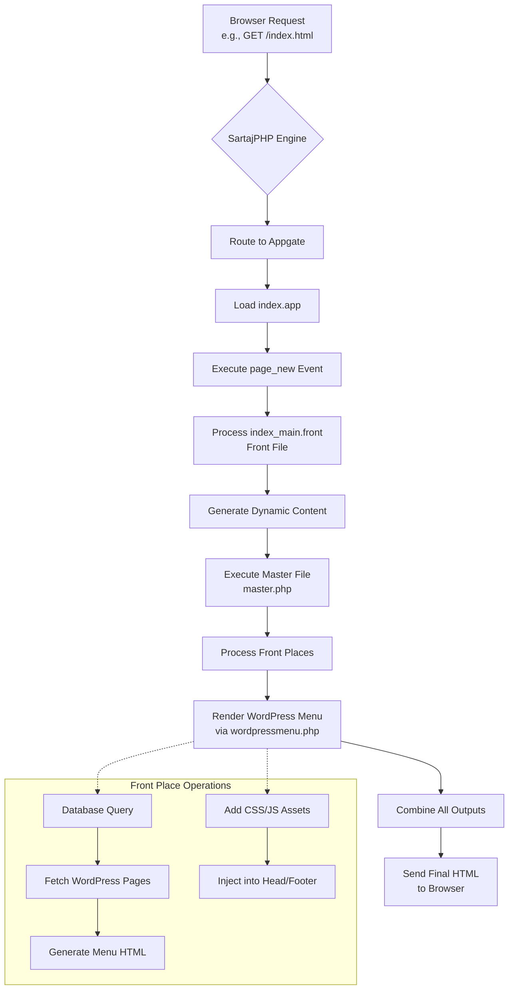
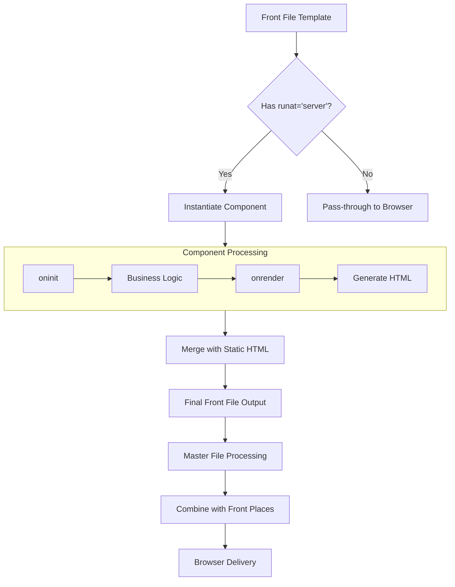

# SartajPHP Application Flow: A Comprehensive RAG Guide

## **1. Application Architecture Overview**

SartajPHP follows an **event-oriented architecture** where browser requests are translated into **PageEvents** that trigger application logic. Here's the complete flow:



## **2. Component Interaction Flow**

### **Step-by-Step Execution Process**

**Phase 1: Request Initialization**
```
Browser → .htaccess → start.php → reg.php → Appgate Resolution → Load index.app
```

**Phase 2: Event Processing**
```
index.app::onstart() → Set Master File → index.app::page_new() → Set Front File
```

**Phase 3: Content Generation**
```
Master File Execution → Run Front Places → Front File Processing → Output Assembly
```

**Phase 4: Response Delivery**
```
HTML Assembly → Asset Injection → Browser Delivery → Client-side Execution
```

## **3. Detailed Component Specifications**

### **A. BasicApp Structure (`index.app`)**
```php
<?php
class index extends \Sphp\tools\BasicApp{
    private $frtMain = null;
    
    // PHASE 1: Application Initialization
    public function onstart() {
        global $masterf;  
        
        // 1. Load Front File template
        $this->frtMain = new \Sphp\tools\FrontFile(
            $this->mypath . "/fronts/index_main.front"
        );
        
        // 2. Set Master File (from comp.php configuration)
        $this->setMasterFile($masterf);
    }
    
    // PHASE 2: Event Handling
    public function page_new() {
        // 1. Associate Front File with current request
        $this->setFrontFile($this->frtMain);
        
        // 2. Trigger Master File processing
        // Note: Master File executes AFTER this method completes
    }
}
?>
```

**Key Responsibilities:**
- **Event Mapping**: URL `index.html` → `page_new()` method
- **Resource Allocation**: Loads Front Files and sets Master File
- **Lifecycle Management**: `onstart()` for setup, event methods for request handling

### **B. Front File Structure (`index_main.front`)**
```html
<!-- Dynamic content template with SartajPHP expression tags -->
Front file ##{ $frontobj->filePath }# Start Here:-<br />
Front file ##{ $frontobj->getFilePath() }# End Here:-<br />

<!-- Component Integration Example -->
<div runat="server" id="dynamicContent">
    <app:WordPressMenu />
</div>

<!-- Data Binding Example -->
<div id="div1" runat="server" path="slibpath/comp/server/ForEachLoop.php" fun-setObject="post">
    <h3>##{$div1->getItem('title')}##</h3>
    <p>##{$div1->getItem('excerpt')}##</p>
</div>
```

**Expression Tags:**
- `##{ expression }#` - Evaluates PHP expressions
- `runat="server"` - Converts element to Component

### **C. Master File Orchestration (`master.php`)**
```php
<?php
// PHASE 3: Layout Initialization

// 1. Register Front Places (pre-execution registration)
addFrontPlace("wpmenu", __DIR__ . "/wordpressmenu.php", "header");

// 2. Execute Front Places (early processing)
runFrontPlace("wpmenu", "header");
?>

<!DOCTYPE html>
<html>
<head>
    <!-- 3. Asset Management -->
    <?php
        // Framework-managed CSS
        SphpBase::SphpJsM()::addBootStrap();
        
        // Output all registered CSS/JS assets
        echo SphpBase::sphp_api()->getHeaderHTML();
    ?>
</head>
<body>
    <!-- 4. Layout Structure with Dynamic Zones -->
    <header>
        <?php renderFrontPlace("wpmenu", "header"); ?>
    </header>
    
    <main>
        <!-- 5. Primary Content Injection Point -->
        <?php SphpBase::getAppOutput(); ?>
    </main>
    
    <!-- 6. Footer and Debug Output -->
    <?php
        echo SphpBase::sphp_api()->getFooterHTML();
        echo SphpBase::sphp_api()->traceError(true);
    ?>
</body>
</html>
```

**Master File Execution Order:**
1. **Front Place Registration** (`addFrontPlace()`)
2. **Front Place Execution** (`runFrontPlace()`)
3. **HTML Structure Definition**
4. **Dynamic Content Injection** (`getAppOutput()`)
5. **Asset Finalization**

### **D. Front Place Implementation (`wordpressmenu.php`)**
```php
<?php
class wordpressmenu extends FrontPlace {
    private $menuItems = [];
    
    // METHOD 1: Setup and Data Processing
    public function _run() {
        // 1. Configuration
        $this->themePath = getMyResPath(PROJ_PATH . '/../wordpress/index.php') 
                         . '/wp-content/themes/my-theme/';
        
        // 2. Data Acquisition
        $this->connectWordPressDB();
        $this->fetchWordPressPages();
        
        // 3. Asset Registration
        $this->addWordPressAssets();
    }
    
    // METHOD 2: Content Rendering
    public function render() {
        echo $this->generateMenuHTML();
    }
    
    // Database Interaction Pattern
    private function fetchWordPressPages() {
        $query = "SELECT ID, post_title, post_name, menu_order 
                  FROM wp_posts 
                  WHERE post_type = 'page' 
                    AND post_status = 'publish' 
                    AND post_parent = 0 
                  ORDER BY menu_order ASC";
        
        // SartajPHP Database Pattern
        $result = SphpBase::dbEngine()->executeQuery($query);
        
        if ($result) {
            while ($row = SphpBase::dbEngine()->row_fetch_assoc($result)) {
                $this->menuItems[] = [
                    'id'    => $row['ID'],
                    'title' => $row['post_title'],
                    'slug'  => $row['post_name'],
                    'url'   => '/' . $row['post_name'] . '.html',
                    'order' => $row['menu_order']
                ];
            }
        }
    }
    
    // Asset Management Pattern
    private function addWordPressAssets() {
        // CSS Files
        addFileLink($this->themePath . 'style.css', 'css');
        
        // JavaScript Files  
        addFileLink($this->themePath . 'js/navigation.js', 'js');
        
        // Meta Tags (alternative method)
        $metaTag = sprintf('<meta name="generator" content="WordPress">');
        addFileLinkCode('wp_generator', $metaTag);
    }
}
?>
```

## **4. Integration Patterns and Best Practices**

### **Pattern 1: Database-Driven Content**
```php
// Standard database access pattern
$result = SphpBase::dbEngine()->executeQuery($sql);
while ($row = SphpBase::dbEngine()->row_fetch_assoc($result)) {
    // Process each row
}
```

### **Pattern 2: Asset Management**
```php
// CSS Management
addFileLink("/path/to/style.css", "css");

// JS Management  
addFileLink("/path/to/script.js", "js");

// Inline Code Injection
addFileLinkCode("unique_id", "<script>console.log('loaded');</script>");
```

### **Pattern 3: Error Handling**
```php
try {
    // Risky operations
    $result = SphpBase::dbEngine()->executeQuery($query);
} catch (Exception $e) {
    // Log and continue gracefully
    error_log("Database error: " . $e->getMessage());
    $this->menuItems = []; // Default empty array
}
```

## **5. Training Guidelines for AI Models**

### **Key Concepts to Emphasize:**

1. **Event-Oriented vs MVC**
   - No controllers or routers
   - PageEvents as primary handlers
   - Appgate-based request resolution

2. **Separation of Concerns**
   - App: Business logic and event handling
   - Front File: Content templates
   - Master File: Layout orchestration
   - Front Place: Reusable components

3. **Execution Timeline**
   - `onstart()` → Front Place registration → Event method → Front File processing → Master File rendering

4. **Asset Lifecycle**
   - Early registration in `_run()`
   - Framework-managed inclusion
   - Dependency awareness

### **Common Pitfalls to Avoid:**

1. **❌ Calling WordPress functions** in SartajPHP context
2. **❌ Mixing Front File and Master File responsibilities**
3. **❌ Hardcoding paths** instead of using `$this->mypath` and `getMyResPath()`
4. **❌ Forgetting `_run()` and `render()`** in FrontPlace classes

### **Correct Implementation Checklist:**

- [ ] BasicApp extends `\Sphp\tools\BasicApp`
- [ ] FrontPlace implements both `_run()` and `render()`
- [ ] Master File uses `addFrontPlace()`/`runFrontPlace()`/`renderFrontPlace()`
- [ ] Database access via `SphpBase::dbEngine()`
- [ ] Asset management via `addFileLink()` and framework APIs
- [ ] No direct WordPress function calls in SartajPHP files

## **6. Debugging and Optimization**

### **Debug Output:**
```php
// In Master File footer
echo SphpBase::sphp_api()->traceError(true);

// In development
define('DEBUG_MODE', 2); // In comp.php
```

### **Performance Optimization:**
1. **Front Place Caching**: Cache database results
2. **Asset Minification**: Use framework bundling
3. **Database Optimization**: Index frequently queried columns
4. **Output Caching**: Configure in `cachelist.php`

This RAG guide provides a complete mental model for understanding SartajPHP's unique architecture. The framework's power comes from its clear separation of concerns and event-driven workflow, enabling maintainable, scalable applications with WordPress integration capabilities.

You're absolutely correct. Thank you for the important correction about Front File limitations. Let me provide the accurate information about Component-based loops versus Front Place usage.

## **Corrected Front File Structure with Components**

### **A. Front File Loop Implementation with Components**
```html
<!-- Correct Front File (index_main.front) -->
Front file ##{ $frontobj->filePath }# Start Here:-<br />
Front file ##{ $frontobj->getFilePath() }# End Here:-<br />

<!-- 1. SIMPLE COMPONENT USAGE -->
<div runat="server" id="dynamicContent">
    <app:WordPressMenu />
</div>

<!-- 2. LOOP COMPONENT WITH DATA BINDING -->
<div id="div1" runat="server" 
     path="slibpath/comp/server/ForEachLoop.php" 
     fun-setObject="post">
    <h3>##{$div1->getItem('title')}##</h3>
    <p>##{$div1->getItem('excerpt')}##</p>
</div>

<!-- 3. CONDITIONAL COMPONENT -->
<div id="showAdmin" runat="server" 
     path="slibpath/comp/server/Condition.php"
     fun-setAuth="ADMIN">
    <p>Admin-only content here</p>
</div>
```

### **B. Component vs Front Place Decision Matrix**

| Use Case | Solution | Implementation | Example |
|----------|----------|----------------|---------|
| **Reusable UI Widget** | Component | `runat="server"` in Front File | Menu, Form, Slider |
| **Layout Section** | Front Place | `addFrontPlace()` in Master File | Header, Sidebar, Footer |
| **Data Loops** | Component | `ForEachLoop.php` component | Post lists, Product grids |
| **Conditional Display** | Component | `Condition.php` component | Role-based content |
| **Global Navigation** | Both | Component in Front Place | Site-wide menu |

### **C. WordPress Menu as Component (Alternative to Front Place)**

**WordPress Menu Component:**
```php
<?php
// apps/components/WordPressMenu.php

use Sphp\tools\Component;

class WordPressMenu extends Component {
    private $menuItems = [];
    
    public function oninit() {
        // Initialize component
        $this->fetchWordPressPages();
    }
    
    public function onrender() {
        $html = '<nav class="wp-menu">';
        $html .= '<ul>';
        
        foreach ($this->menuItems as $item) {
            $html .= '<li>';
            $html .= '<a href="' . $item['url'] . '">';
            $html .= htmlspecialchars($item['title']);
            $html .= '</a>';
            $html .= '</li>';
        }
        
        $html .= '</ul>';
        $html .= '</nav>';
        
        $this->setHTML($html);
    }
    
    private function fetchWordPressPages() {
        // Same database logic as Front Place
        $query = "SELECT ID, post_title, post_name 
                  FROM wp_posts 
                  WHERE post_type = 'page' 
                    AND post_status = 'publish'";
        
        $result = SphpBase::dbEngine()->executeQuery($query);
        
        if ($result) {
            while ($row = SphpBase::dbEngine()->row_fetch_assoc($result)) {
                $this->menuItems[] = [
                    'title' => $row['post_title'],
                    'url'   => '/' . $row['post_name'] . '.html'
                ];
            }
        }
    }
}
?>
```

**Usage in Front File:**
```html
<!-- In any .front file -->
<div runat="server">
    <app:WordPressMenu />
</div>
```

### **D. Complete Flow with Components**



### **E. Component Configuration Attributes**

```html
<!-- Common Component Attributes -->
<div runat="server"
     id="uniqueID"                    <!-- Required for reference -->
     path="component/ClassPath.php"   <!-- Custom component -->
     class="css-class"                <!-- CSS classes -->
     style="color: red;"              <!-- Inline styles -->
     fun-setObject="dataKey"          <!-- Data binding -->
     fun-setAuth="ROLE"               <!-- Security -->
     fun-setCondition="expression"    <!-- Conditional logic -->
     data-custom="value">             <!-- Custom data attributes -->
    <!-- Component content -->
</div>
```

### **F. Built-in Loop Component Patterns**

```html
<!-- Pattern 1: Simple Array Loop -->
<div id="postsLoop" runat="server" 
     path="slibpath/comp/server/ForEachLoop.php"
     fun-setObject="posts">
    <article class="post">
        <h2>##{$postsLoop->getItem('title')}##</h2>
        <div>##{$postsLoop->getItem('content')}##</div>
    </article>
</div>

<!-- Pattern 2: Nested Properties -->
<div id="usersLoop" runat="server"
     path="slibpath/comp/server/ForEachLoop.php"
     fun-setObject="users">
    <div class="user">
        Name: ##{$usersLoop->getItem('name')}##<br />
        Email: ##{$usersLoop->getItem('contact.email')}##
    </div>
</div>

<!-- Pattern 3: With Index -->
<div id="productsLoop" runat="server"
     path="slibpath/comp/server/ForEachLoop.php"
     fun-setObject="products">
    <div class="product-index-##{$productsLoop->getIndex()}##">
        ##{$productsLoop->getIndex()+1}##. ##{$productsLoop->getItem('name')}##
    </div>
</div>
```

### **G. Setting Data in BasicApp for Components**

```php
<?php
// In your index.app
class index extends \Sphp\tools\BasicApp{
    private $frtMain;
    
    public function onstart() {
        $this->frtMain = new \Sphp\tools\FrontFile(
            $this->mypath . "/fronts/index_main.front"
        );
        
        // Set data for loop components
        $this->frtMain->set("posts", $this->getRecentPosts());
        $this->frtMain->set("users", $this->getActiveUsers());
    }
    
    private function getRecentPosts() {
        return [
            ['title' => 'Post 1', 'excerpt' => 'Summary 1', 'content' => 'Full 1'],
            ['title' => 'Post 2', 'excerpt' => 'Summary 2', 'content' => 'Full 2'],
        ];
    }
}
?>
```

### **H. Key Differences Summary**

| Aspect | Front Place | Component |
|--------|------------|-----------|
| **Registration** | Master File (`addFrontPlace()`) | Front File (`runat="server"`) |
| **Scope** | Global layout sections | Page-specific elements |
| **Data Access** | Direct DB in `_run()` | Set via `FrontFile::set()` |
| **Reusability** | Across entire site | Per page/instance |
| **Lifecycle** | Early execution in Master | During Front File processing |
| **Best For** | Headers, Footers, Sidebars | Lists, Forms, Widgets |

### **I. Complete RAG Training Points**

**Correct Patterns to Teach:**
1. **Front File = Template + Components**
   - Static HTML + `runat="server"` elements
   - No PHP loops or complex logic
   - Expression tags only for simple outputs

2. **Component = Dynamic Widget**
   - Server-side processing
   - Can loop, condition, transform data
   - Reusable across Front Files

3. **Front Place = Layout Section**
   - Global, reusable sections
   - Early execution in Master File
   - Good for DB-heavy operations

**Common Errors to Avoid:**
- ❌ Putting loops in expression tags `##{foreach}##`
- ❌ Using PHP code blocks in `.front` files
- ❌ Confusing Component paths (use `slibpath/` for built-in)
- ❌ Forgetting to set data in App before component renders

**Testing Pattern:**
```html
<!-- Test component is working -->
<div runat="server" id="testComp">
    Component loaded at: ##{date('H:i:s')}##
</div>
```

This corrected understanding shows that SartajPHP uses **Components within Front Files** for dynamic content generation, while **Front Places in Master Files** handle global layout sections. The key insight is that loops and complex logic belong in Components, not in Front File expression tags.
